=======
Ecuador
=======

Introduction
============

With the Ecuadorian localization, it is possible to generate electronic documents using XML, fiscal
folio, electronic signature, and direct connection to tax authority SRI.

The supported documents are invoices, credit notes, debit notes, purchase liquidations, and
withholds.

The localization also includes automations to easily predict the withholding tax to be applied to
each purchase invoice.

.. seealso::
   - `App Tour - Localización de Ecuador <https://www.youtube.com/watch?v=BQOXVSDeeK8>`_
   - `Smart Tutorial - Localización de Ecuador <https://www.odoo.com/slides/smart-tutorial-localizacion-de-ecuador-170>`_

Glossary
--------

Here are some terms that are essential to the Ecuadorian localization:

.. _fiscal_localizations/ecuador/SRI:

- **SRI**: stands for *Servicio de Rentas Internas*, which is the government organization that
  enforces pay of taxes in Ecuador
- **SRI certificate**: a document or digital credential issued by the *SRI* that is crucial for
  compliance with Ecuadorian tax laws
- **EDI**: stands for *Electronic Data Interchange*, which refers to the sending of Electronics
  Documents
- **RIMPE**: stands for *Regimen Simplificado para Emprendedores y Negocios*, which is the type of
  taxpayer qualified for SRI

Configuration
=============

.. _l10n_ec/module-installation:

Modules installation
--------------------

:ref:`Install <general/install>` the following modules to get all the features of the Ecuadorian
localization:

.. list-table::
   :header-rows: 1
   :widths: 25 25 50

   * - Name
     - Technical name
     - Description
   * - :guilabel:`Ecuadorian - Accounting`
     - `l10n_ec`
     - The default :doc:`fiscal localization package <../fiscal_localizations>`, adds accounting
       characteristics for the Ecuadorian localization, which represent the minimum configuration
       required for a company to operate in Ecuador according to the guidelines set by the
       :abbr:`SRI (servicio de rentas internas)`. The module's installation automatically loads:
       Chart of Accounts, taxes, documents types, tax support types. Additionally, the generation of
       forms 103 and 104 are automatic.
   * - :guilabel:`Ecuadorian Accounting EDI`
     - `l10n_ec_edi`
     - Includes all the technical and functional requirements to generate and validate
       :doc:`Electronics Documents
       <../accounting/customer_invoices/electronic_invoicing>`, based on the Technical
       documentation published by the SRI. The authorized documents are: Invoices, Credit Notes,
       Debit Notes, Withholdings and Purchase liquidations.
   * - :guilabel:`Ecuadorian Accounting Reports`
     - `l10n_ec_reports`
     - Includes all the technical and functional requirements to generate forms 103 and 104.
   * - :guilabel:`Ecuador - ATS Report`
     - `l10n_ec_reports_ats`
     - Includes all the technical and functional requirements to generate the ATS report XML file
       ready to be uploaded to the *DIMM Formularios*.
   * - :guilabel:`Ecuadorian Website`
     - `l10n_ec_website_sale`
     - Includes all the technical and functional requirements to generate automatic electronic
       invoices from a Website sale.
   * - :guilabel:`Ecuadorian Point of Sale`
     - `l10n_ec_edi_pos`
     - Includes all the technical and functional requirements to generate automatic electronic
       invoices from a POS sale.

.. note::
   When installing a database from scratch and selecting `Ecuador` as the country, Odoo
   automatically installs the base module :guilabel:`Ecuadorian - Accounting`.

.. _l10n_ec/configure-your-company:

Configure a company or individual contact
-----------------------------------------

To configure a company's information, first activate :ref:`developer mode <developer-mode>`, then,
go to the **Contacts** app.

To find an existing contact, either scroll and find the contact or enter their name in the
search bar up top. Or, to add a new contact, click :guilabel:`New` in the top left corner.

On the contact form, select either the :guilabel:`Company` or :guilabel:`Individual` radio
button. The following fields should be completed for localization purposes:
- :guilabel:`Name`: Enter the company or individual's name.
- :guilabel:`Address`: The :guilabel:`Street` sub-field is reuiqred to confirm electronic invoices.
- :guilabel:`Identification Number`: For a company, enter the `RUC`. For individuals, enter the `Cedula` or `Passport` number.
- :guilabel:`SRI Taxpayer Type`: Select the contact's SRI taxpayer type.
- :guilabel:`Phone`: Enter the company or individual's phone number.
- :guilabel:`Email`: Enter the company or individual's email. This email will be used when sending electronic documents, such as invoices.

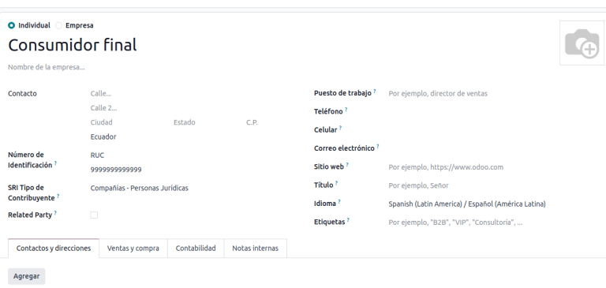

.. note::
   The :ref:`SRI Taxpayer Type <l10n_ec/VAT-withholding>` indicated on the contact form determines
   which VAT and profit withholding taxes will apply when using this contact on a vendor bill.

Electronic documents
--------------------

To upload information for electronic documents, go to
:menuselection:`Accounting app --> Configuration --> Settings`, and search for
:guilabel:`Ecuadorian Localization`.

.. important::
   :guilabel:`Ecuadorian Localization` will only be visible if the :guilabel:`Ecuador` package
    has been selected under :ref:`Fiscal Localization <fiscal_localizations/packages>`.

Configure the following information for the company:

- :guilabel:`Company legal name`
- :guilabel:`Regime`: Select whether the company is in the :guilabel:`Regular Regime` or is
   qualified as in the :guilabel:`RIMPE Regime`.
- :guilabel:`Special Taxpayer Number`: If the company is qualified as a special taxpayer,
   complete this field with the company's corresponding tax contributor number.
- :guilabel:`Forced to Keep Accounting Books`: Tick this checkbox if the company has this
   condition.
- :guilabel:`Consumables`: Enter the code of the default withholding tax used when purchasing goods.
- :guilabel:`Services`: Enter the code of the default withholding tax used when purchasing services.
- :guilabel:`Credit Card`: Enter the code of the default withholding tax used when
   purchasing with credit cards.
- :guilabel:`Withhold Agent Number`: Enter the company's withholding agent resolution number, if
   applicable.
- :guilabel:`Certificate file for SRI`: Select the company's :ref:`SRI certificate <fiscal_localizations/ecuador/SRI>`.
   Click :guilabel:`SRI Certificates` to upload one, if necessary.
- :guilabel:`Use production servers`: Tick this checkbox if your company is going to do electronic
   documents in the production environment. To use the testing environment for electronic
   documents, leave the checkbox unticked.
- :guilabel:`Sales Tax Base Account`: Enter the company's sales tax base account.
- :guilabel:`Purchase Tax Base Account`: Enter the company's sales tax purchase account.

.. note::
   The values entered in the :guilabel:`Consumables` and :guilabel:`Services` withholding fields are
   used as default values for domestic **only when** no withholdings are set up on their
   *SRI Taxpayer Type*. Moreover, the entered :guilabel:`Credit Card` withholding value is always
   used when a credit or debit card SRI payment method is used.

.. _l10n_ec/VAT-withholding:

VAT withholding
---------------

This configuration only applies if the company being configured is qualified as a *withholding
agent* by the SRI. Otherwise, skip this step.

To configure a VAT withholding, go to
:menuselection:`Accounting app --> Configuration --> Ecuadorian SRI: Taxpayer Type SRI`.

It is necessary to configure the :guilabel:`Name` of the taxpayer type, the
:guilabel:`Goods VAT Withholding`, and the :guilabel:`Services VAT Withholding`.

.. tip::
   In the case that the :guilabel:`Taxpayer Type` is `RIMPE`, also configure the
   :guilabel:`Profit Withholding` percentage.

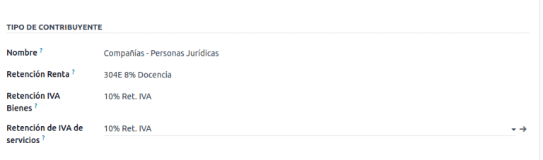

Printer points
--------------

Printer points need to be configured for each type of electronic document used, such as for
customer invoices, credit notes, and debit notes.

To configure your *printer points*, navigate to
:menuselection:`Accounting app --> Configuration --> Accounting: Journals`.

For each printer point, click :guilabel:`New`, and enter the following information on the journal
form:

- :guilabel:`Journal Name`: This field should be entered in this format:
  `[Emission Entity]-[Emission Point] [Document Type]`. For example: `001-001 Sales Documents`.
- :guilabel:`Type`: This field refers to the type of journal. Select `Sales`.

Once *Sales* is selected in the :guilabel:`Type` field, the following fields will appear and should
be completed:
- :guilabel:`Use Documents?`: This checkbox is automatically ticked; *leave it ticked*.
- :guilabel:`Emission Entity`: Enter the establishment number in this field.
- :guilabel:`Emission Point`: Enter the printer point in this field.
- :guilabel:`Emission Address`: Enter the address of the establishment in this field.
- :guilabel:`Default Income Account`: Enter the default income account in this field.
- :guilabel:`Dedicated Credit Note Sequence`: Check this checkbox if *credit notes* should be generated from this printer point (i.e. the journal).
- :guilabel:`Dedicated Debit Note Sequence`: Check this checkbox if *debit notes* should be generated from this printer point (i.e. the journal).
- :guilabel:`Short Code`: This is the unique code for the sequence of accounting entries. Enter a unique 5-digit code. For example: `VT001`.

Customer invoices, credit notes, and debit notes need to use the same journal as the
:guilabel:`Emission Point`, whereas the :guilabel:`Entity Point` should be unique per journal.

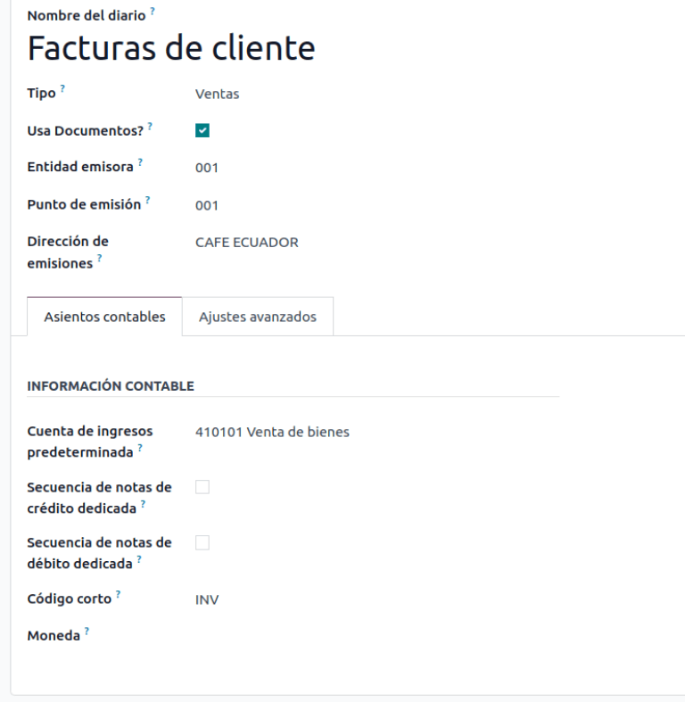

.. note::
   In the :guilabel:`Advanced Settings` tab, check the :guilabel:`Electronic Invoicing` checkbox to
   enable it for Ecuador.

.. seealso::
   :doc:`../accounting/customer_invoices/electronic_invoicing`

Withholding
-----------

A *withholding journal* must be defined by going to
:menuselection:`Accounting app --> Configuration --> Accounting:  Journals`. For each withholding
journal, click :guilabel:`New`, and enter the following information:

- :guilabel:`Journal Name`: This field should be entered in this format:
  `[Emission Entity]-[Emission Point] [Document Type]`. For example: `001-001 Withholding`.
- :guilabel:`Type`: This refers to the type of journal. Select `Miscellaneous`.
- :guilabel:`Withhold Type`: Select `Purchase Withhold`.

Once *Miscellaneous* is selected in the :guilabel:`Type` field and *Purchase Withhold* as the
:guilabel:`Withhold Type`, the following fields will appear and should be completed:
- :guilabel:`Emission Entity`: Enter the establishment number in this field.
- :guilabel:`Emission Point`: Enter the printer point in this field.
- :guilabel:`Emission Address`: Enter the address of the establishment in this field.
- :guilabel:`Default Account`: Configure the default income account.
- :guilabel:`Short Code`: This is the unique code for the sequence of accounting entries. Enter a unique 5-digit code. For example: `WT001`.

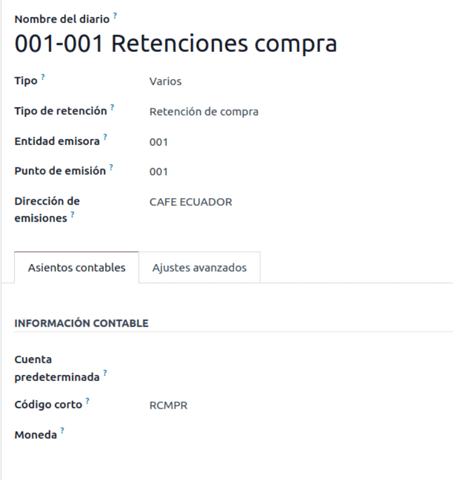

.. note::
   In the :guilabel:`Advanced Settings` tab, tick the :guilabel:`Electronic Invoicing` checkbox to
   enable the sending of electronic invoicing for the withholding.

Purchase liquidations
---------------------

A specific journal must be created for *purchase liquidations*. Go to
:menuselection:`Accounting app --> Configuration --> Accounting: Journals`. Click :guilabel:`New`,
and configure the following information:

- :guilabel:`Journal Name`: This field should be entered in this format:
  `[Emission Entity]-[Emission Point] [Document Type]`. For example:
  `001-001 Purchase Liquidations`.
- :guilabel:`Type`: This refers to the type of journal. Select `Purchase`.

Once *Purchase* is selected in the :guilabel:`Type` field, the following fields will appear and
should be completed:
- :guilabel:`Purchase Liquidations`: Tick this checkbox to enable purchase liquidations.
- :guilabel:`Use Documents?`: This checkbox is automatically ticked; *leave it ticked*.
- :guilabel:`Emission Entity`: Enter the establishment number in this field.
- :guilabel:`Emission Point`: Enter the printer point in this field.
- :guilabel:`Emission Address`: Enter the address of the establishment in this field.
- :guilabel:`Short Code`: This is the unique code for the sequence of accounting entries. Enter a unique 5-digit code. For example: `PT001`.

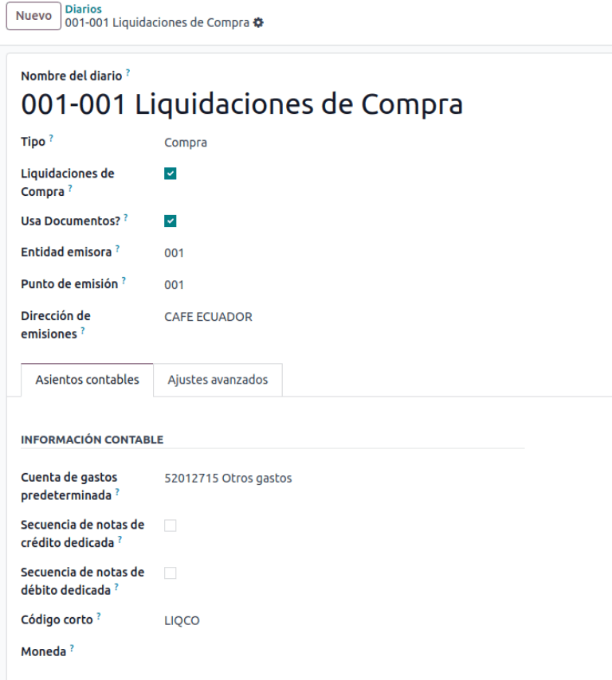

.. note::
   In the :guilabel:`Advanced Settings` tab, check the :guilabel:`Electronic Invoicing` checkbox to
   enable the sending of electronic invoicing for the withholding.

Configure master data
---------------------

Chart of accounts
~~~~~~~~~~~~~~~~~

The :doc:`chart of accounts <../accounting/get_started/chart_of_accounts>`
is installed by default as part of the set of data included in the localization module. The accounts
are mapped automatically in Taxes, Default Account Payable, Default Account Receivable.

The chart of accounts for Ecuador is based on the most updated version of *Superintendency of
Companies*, which is grouped in several categories and is compatible with NIIF accounting.

Accounts can be added or deleted according to the company's needs.

Products
~~~~~~~~

If products have any withholding taxes, they must be configured on the product form. Go to
:menuselection:`Accounting app --> Vendors --> Products`. On the :guilabel:`General Information`
tab, both :guilabel:`Purchase Taxes` and :guilabel:`Profit Withhold` can be specified.

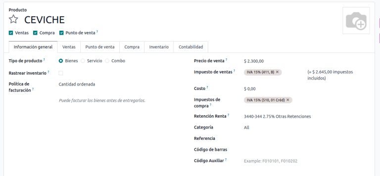

Review configured taxes
~~~~~~~~~~~~~~~~~~~~~~~

As part of the localization module, taxes are automatically created with its configuration and
related financial accounts.

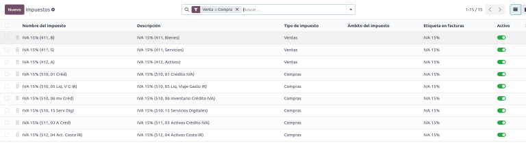

The following options have been automatically configured:
- :guilabel:`Tax Support`: This field should only be configured in the IVA tax. This option is useful when registering purchase withholdings.
- :guilabel:`Code ATS`: This field should only be configured for income tax withholding codes. It is important to use when registering a withholding.
- :guilabel:`Tax Grids`: This field is for configuring the codes of a 104 form if it is a IVA tax, and the codse of a 103 form if it is an income tax withholding codes.
- :guilabel:`Tax Name`: **For IVA tax**, format the name as, `IVA [percent] (104, [form code] [tax support code] [tax support short name])`. **For income tax withholding codes**: Format the name as, `Code ATS [percent of withhold] [withhold name]`.

Once the *Ecuador module* is installed, the most common taxes are automatically configured.
To create an additional tax, base it on the configuration of the existing taxes.

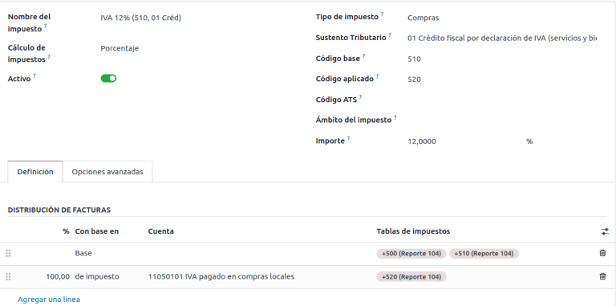

.. seealso::
   :doc:`Configuring taxes <../accounting/taxes>`

Review your document types
~~~~~~~~~~~~~~~~~~~~~~~~~~

Some accounting transactions like *customer invoices* and *vendor bills* are classified by
**document types**. These are defined by the government fiscal authorities, which in this case is
the SRI. Document types can be accessed or configured by going to
:menuselection:`Accounting app --> Configuration --> Accounting: Document Types`.

Each document type can have a unique sequence per journal where it is assigned. As part of the
localization, the document type includes the country on which the document is applicable; also the
data is created automatically when the localization module is installed.

The information required for the document types is included by default so the user does not need to
fill anything there.

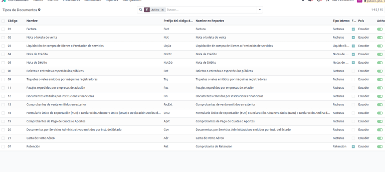

Workflows
=========

Once a company's database is configured, document types can be registered so that workflows can
be completed across Odoo's applications, such as **Accounting**, **Inventory**, and **Sales**.

Sales documents
---------------

Customer invoices
~~~~~~~~~~~~~~~~~

:guilabel:`Customer invoices` are electronic documents that, when validated, are sent to SRI. These
documents can be :doc:`created from your sales order or manually <../accounting/customer_invoices/overview>`.
They must contain the following data:

- :guilabel:`Customer`: Type the customer's information.
- :guilabel:`Journal`: Select the option that matches the printer point for the customer invoice.
- :guilabel:`Document Type`: Type the document type in this format: `(01) Invoice`.
- :guilabel:`Payment Method (SRI)`: Select how the invoice is going to be paid.
- :guilabel:`Products`: Specify the product with the correct taxes.

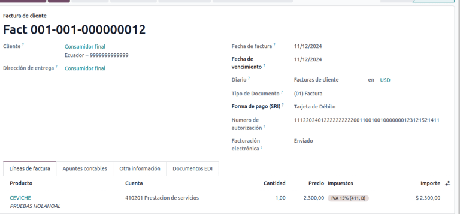

Customer credit note
~~~~~~~~~~~~~~~~~~~~

The :doc:`Customer credit note <../accounting/customer_invoices/credit_notes>` is an
electronic document that, when validated, is sent to SRI. It is necessary to have a validated
(posted) invoice to register a credit note. On the invoice, there is a button named
:guilabel:`Credit note`; click on this button to be directed to the :guilabel:`Create credit note`
form, then complete the following information:

- :guilabel:`Credit Method`: Select the type of credit method.

  - :guilabel:`Partial Refund`: Use this option to type the first number of documents,
     and if it is a partial credit note.
  - :guilabel:`Full Refund`: Use this option if the credit note is for the total invoice, and the
     credit note needs to be auto-validated and reconciled with the invoice.
  - :guilabel:`Full refund and new draft invoice`: Use this option if the credit note is for the
     total invoice, the credit note needs to be auto-validated and reconciled with the
     invoice, and to auto-create a new draft invoice.

- :guilabel:`Reason`: Type the reason for the credit note.
- :guilabel:`Rollback Date`: Select the :guilabel:`specific` options.
- :guilabel:`Reversal Date`: Type the date.
- :guilabel:`Use Specific Journal`: Select the printer point for your credit note, or leave it empty
   to use the same journal as the original invoice.

Once reviewed, click on the :guilabel:`Reverse` button.

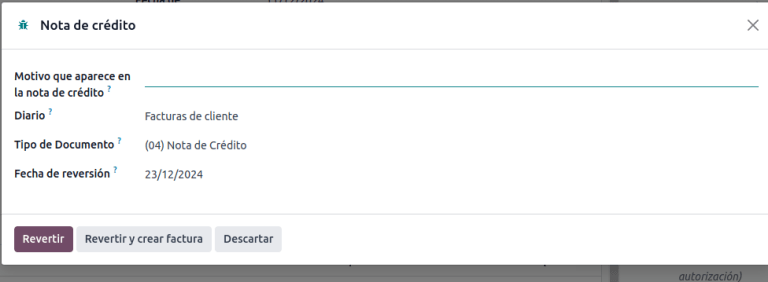

When the :guilabel:`Partial Refund` option is used, the amount of the credit note can be changed and
validated. Before validating the credit note, review the following information:

- :guilabel:`Customer`: Type the customer's information.
- :guilabel:`Journal`: Select the printer point for the customer Credit Note.
- :guilabel:`Document Type`: Enter this document type: `(04) Credit Note`.
- :guilabel:`Products`: Specify the product with the correct taxes.

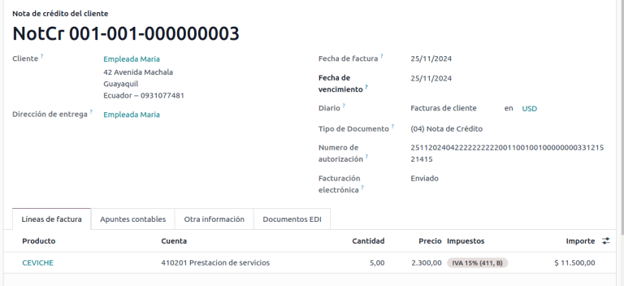

Customer debit note
~~~~~~~~~~~~~~~~~~~

The :guilabel:`Customer debit note` is an electronic document that, when validated, is sent to SRI.
It is necessary to have a validated (posted) invoice in order to register a debit note. On the
invoice, click the :guilabel:`Debit Note` button to be directed to the :guilabel:`Create debit note`
form, and complete the following information:

- :guilabel:`Reason`: Type the reason for the debit note.
- :guilabel:`Debit note date`: Select the :guilabel:`specific` options.
- :guilabel:`Copy lines`: Select this option to register a debit note with the same lines of
   invoice.
- :guilabel:`Use Specific Journal`: Select the printer point for your credit note, or leave it empty
   to use the same journal as the original invoice.

After reviewing this information, click the :guilabel:`Create Debit Note` button.

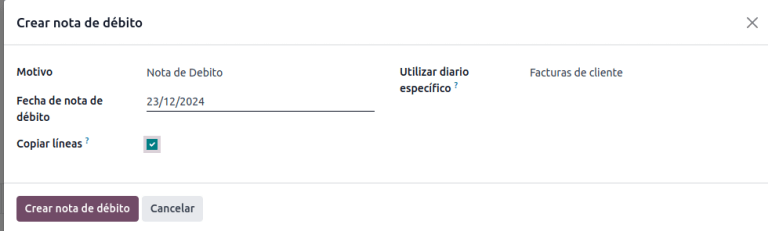

The debit note amount can be changed, if desired. Before validating the debit note, review
the following fields:

- :guilabel:`Customer`: Type the customer's information.
- :guilabel:`Journal`: Select the printer point for the customer Credit Note.
- :guilabel:`Document Type`: Enter this document type: `(05) Debit Note`.
- :guilabel:`Products`: Specify the product with the correct taxes.

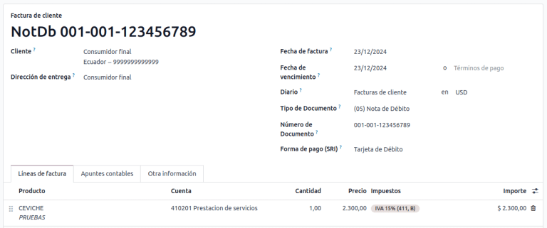

Customer withholding
~~~~~~~~~~~~~~~~~~~~

The :guilabel:`Customer withholding` is a non-electronic document issued by the client in order to
apply a withholding to a sale.

It is necessary to have a validated (posted) invoice to register a customer withholding. On
the invoice, click the :guilabel:`Add Withhold` button to be directed to the
:guilabel:`Customer withholding` form, and complete the following information:

- :guilabel:`Document Number`: Type the withholding number.
- :guilabel:`Withhold Lines`: Select the taxes that the customer is withholding.

Before validating the withholding, review that the amounts for each tax are the same as the original
document.

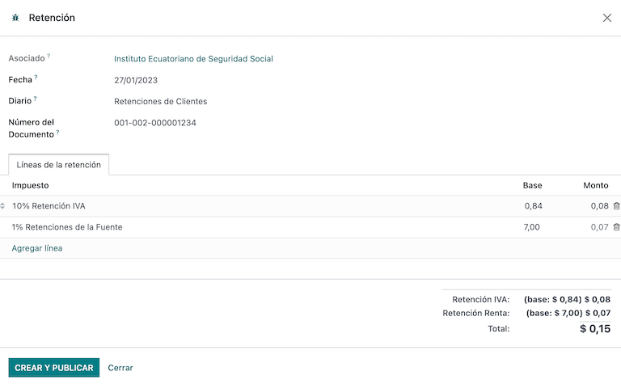

Purchase Documents
------------------

.. _ecuador/vendor-bills:

Vendor bill
~~~~~~~~~~~

:doc:`Vendor bills <../accounting/vendor_bills>` are non-electronic documents issued by vendors when
a company generates a purchase. Vendor bills can be created from purchase orders or manually.

.. important::
   A vendor bill journal must be created to create vendor bill documents.

Create a vendor bill journal
****************************

To create a new journal, go to
:menuselection:`Accounting app --> Configuration --> Accounting: Journals`, and click the
:guilabel:`New` button.

In the journal, be sure the following configurations are enabled to use vendor bills:
- Select `Purchase` as the :guilabel:`Type`
- **Do not** tick the :guilabel:`Purchase Liquidations` checkbox
- Add a :guilabel:`Default Expense Account` for vendor bills

Configure a vendor bill
***********************

When configuring a vendor bill, complete the following information:

- :guilabel:`Vendor`: Enter the vendor's information.
- :guilabel:`Bill Date`: Select the date of invoice.
- :guilabel:`Journal`: Select the journal created for vendor bills.
- :guilabel:`Document Type`: Enter this document type: `(01) Invoice`.
- :guilabel:`Document number`: Enter the document number.
- :guilabel:`Payment Method (SRI)`: Select how the invoice is going to be paid.
- :guilabel:`Products`: Specify the product with the correct taxes.

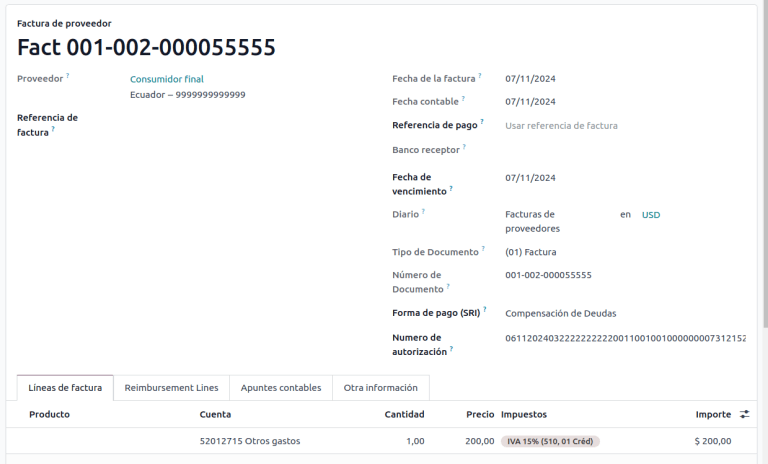

.. important::
   When creating the purchase withholding, verify that the bases (base amounts) are correct. If you
   need to edit the amount of the tax in the :guilabel:`Vendor bill`, click the :guilabel:`Edit`
   button. Otherwise, from the :guilabel:`Journal Items` tab, click the :guilabel:`Edit` button and
   set the adjustment as desired.

.. _ecuador/purchase-liquidation:

Purchase liquidation
~~~~~~~~~~~~~~~~~~~~

:guilabel:`Purchase liquidation` is an electronic document that, when validated, is sent to SRI.

Companies issue this type of electronic document when they purchase something, and the vendor does
not issue an invoice, due to one or more of the following cases:

- Services were provided by non-residents of Ecuador.
- Services were provided by foreign companies without residency or establishment in Ecuador.
- Purchase of goods or services were from natural persons not registered with a RUC, who are not
  able to issue sales receipts or customer invoices.
- Reimbursement for the purchase of goods or services needs to be given to employees in a dependency
  relationship (full-time employee).
- Services have been provided by members of collegiate bodies for the exercise of their function.

.. important::
   A purchase liquidation journal must be created to create purchase liquidation documents.

Create a purchase liquidation journal
*************************************

To create a new journal, go to
:menuselection:`Accounting app --> Configuration --> Accounting: Journals`, and click the
:guilabel:`New` button.

In the journal, be sure the following configurations are set, as they are necessary to perform a
reimbursement:
- Select `Purchase` as the :guilabel:`Type`
- Tick the :guilabel:`Purchase Liquidations` checkbox
- Add a :guilabel:`Default Expense Account`

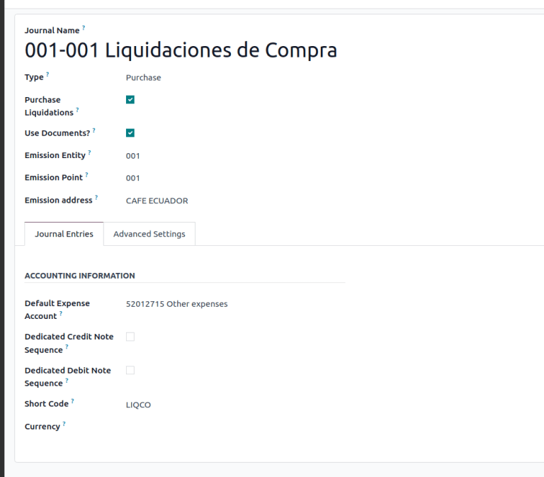

Configure a purchase liquidation
********************************
These types of electronic documents can be created from the *purchase order* or manually
from the *vendor bills* form. Purchase liquidations must contain the following data:

- :guilabel:`Vendor`: Enter the vendor's information.
- :guilabel:`Journal`: Select the :guilabel:`Purchase Liquidation` journal with the correct
   printer point.
- :guilabel:`Document Type`: Enter this document type: `(03) Purchase Liquidation`
- :guilabel:`Document number`: Enter the document number (sequence). This will only need to be
   entered once, and then the sequence will be automatically assigned for the next documents.
- :guilabel:`Payment Method (SRI)`: Select how the invoice is going to be paid.
- :guilabel:`Products`: Specify the product with the correct taxes.

Once the information has been reviewed, validate the :guilabel:`Purchase Liquidation`.

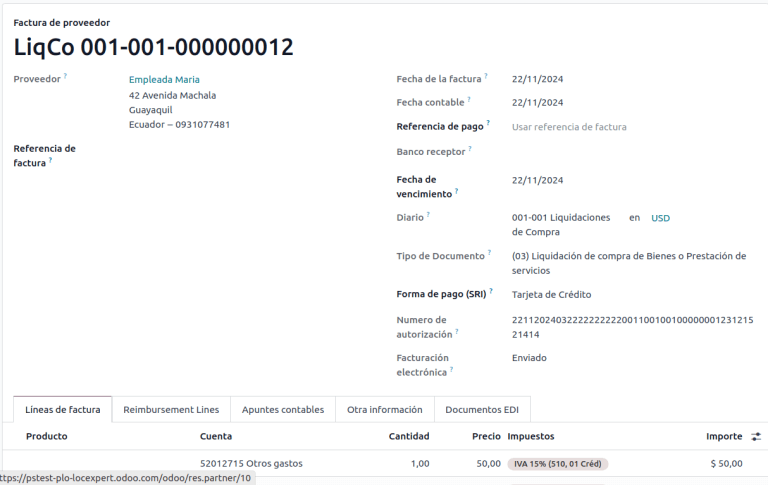

Purchase withholding
~~~~~~~~~~~~~~~~~~~~

The :guilabel:`Purchase withholding` is an electronic document that, when validated, is sent to SRI.

It is necessary to have an invoice in a validated state before registering a
:guilabel:`Purchase withholding`. On the invoice, click the :guilabel:`Add Withhold` button. From
there, complete the following fields on the :guilabel:`Withholding` form:

- :guilabel:`Document number`: Enter the document number (sequence). This will only need to be
   entered once, and then the sequence will be automatically assigned for the next documents.
- :guilabel:`Withhold lines`: The taxes appear automatically according to the configuration of
   products and vendors. Review if the taxes and tax support are correct. If not, edit and select
   the correct taxes and tax support.

Once the information has been reviewed, validate the :guilabel:`Withholding`.

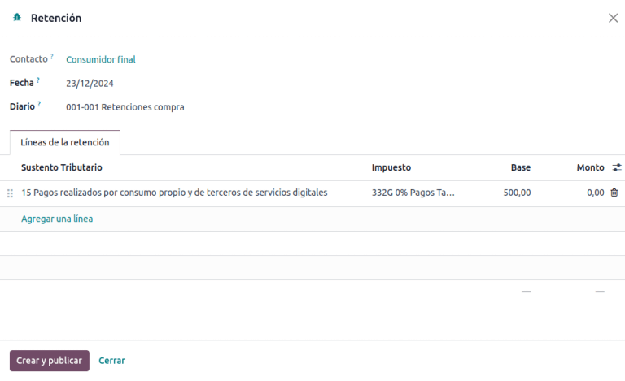

.. note::
   Tax support types must be configured on the :guilabel:`Vendor Bill`. To do so, go to the tax
   applied on the :guilabel:`Vendor Bill` and change the :guilabel:`Tax Support` there.

A withholding tax can be divided into two or more lines, depending on whether two or more
withholdings percentages apply.

.. example::
   The system suggests a VAT withholding of 30% with tax support 01. VAT withholding of 70% can be
   added in a new line with the same tax support, The system will allow it as long as the total
   of the bases matches the total from the :guilabel:`Vendor Bill`.

Expense reimbursement
---------------------

Expense reimbursements apply to the following cases:
- :guilabel:`Individual`: reimbursement to an employee for miscellaneous expenses (e.g. purchase liquidations)
- :guilabel:`Legal Entity:`: reimbursement for incurred expenses, such as representation expenses (e.g. hiring a lawyer)
- :ref:`Vendor Bills <ecuador/vendor-bills>`

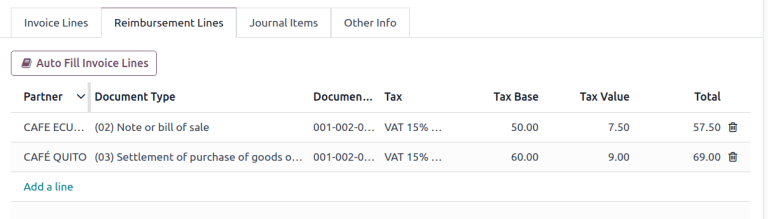

Reimbursing expenses for an individual
~~~~~~~~~~~~~~~~~~~~~~~~~~~~~~~~~~~~~~

To enable expense reimbursement for individuals, make sure a
:ref:`purchase liquidation journal <ecuador/purchase-liquidation>` has been created.

Next, to create a reimbursement, :ref:`create a vendor bill <ecuador/vendor-bills>` using the
*purchase liquidation* journal. On the vendor bill, configure the following fields:
- :guilabel:`Vendor`: This field should be an employee.
- :guilabel:`Document Type`: Verify that this field is accurately populated from the journal.
- :guilabel:`Payment Method (SRI)`: Select a payment method.
- :guilabel:`Reimbursement Lines` tab: Add the expenses line by line, and provide the following details for each expense:

  - :guilabel:`Partner or authorization number`
  - :guilabel:`Date`
  - :guilabel:`Document Type`
  - :guilabel:`Document Number`
  - :guilabel:`Tax Base`
  - :guilabel:`Tax`

After these fields are complete, click the :guilabel:`Auto Fill Invoice Lines` button. If everything
looks accurate, click the :guilabel:`Confirm the Vendor Bill` button, then the :guilabel:`Process
Now` button. The XML and authorization number for the purchase liquidation is recorded, and the
purchase withholding created from this vendor bill will have the reimbursement information.

.. image:: ecuador/l10n-ec-individual-flow.png
   :alt: Expense Reimbursement.

Reimbursing expenses for a legal entity
~~~~~~~~~~~~~~~~~~~~~~~~~~~~~~~~~~~~~~~

To enable expense reimbursement for legal entities, make sure a
:ref:`vendor bills journal <ecuador/vendor-bills>` has been created.

In the journal, be sure the following configurations are set, as they are necessary to perform a
reimbursement for a legal entity:
- Select `Purchase` as the :guilabel:`Type`
- **Do not** tick the :guilabel:`Purchase Liquidations` checkbox
- Add a :guilabel:`Default Expense Account`

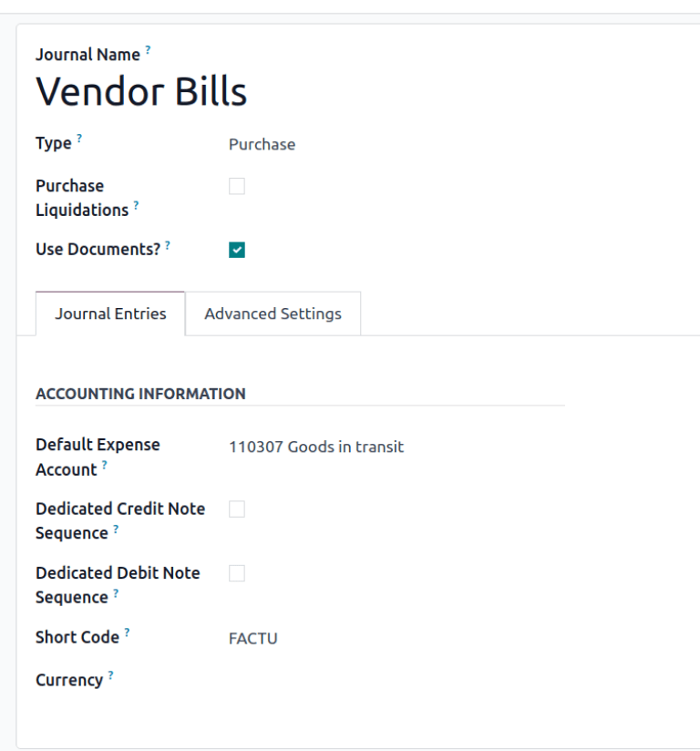

Next, to create the reimbursement, :ref:`create a vendor bill <ecuador/vendor-bills>` using the
*vendor bills* journal. On the vendor bill, configure the following fields:

- :guilabel:`Vendor`: This field should be a vendor whose identification type is
   :guilabel:`RUC`.
- :guilabel:`Document Type`: Verify that this field is accurately populated from the journal.
- :guilabel:`Payment Method (SRI)`: Select a payment method.
- :guilabel:`Reimbursement Lines` tab: Add the expenses line by line, and provide the
   following details for each expense:

	  - :guilabel:`Partner or authorization number`
	  - :guilabel:`Date`
	  - :guilabel:`Document Type`
	  - :guilabel:`Document Number`
	  - :guilabel:`Tax Base`
	  - :guilabel:`Tax`

After these fields are complete, click the :guilabel:`Auto Fill Invoice Lines` button. If everything
looks accurate, click the :guilabel:`Confirm the Vendor Bill` button, then the :guilabel:`Process
Now` button. The XML and authorization number for the purchase liquidation is recorded, and the
purchase withholding created from this vendor bill will have the reimbursement information.

.. note::
   It is not necessary to link a product in the expense lines. After adding the reimbursement lines,
   more lines can be added to represent other expenses that are not reimbursements.

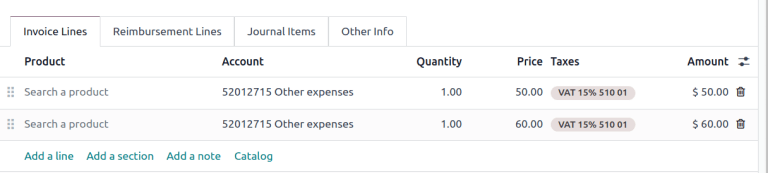

eCommerce
---------

The :ref:`ATS Report module <ecuador/ats>` enables the following:

- Choosing the SRI Payment Method in each payment method's configuration.
- Customers can manually input their identification type and identification number during the
  eCommerce checkout process.
- Automatically generating a valid electronic invoice for Ecuador at the end of the checkout
  process.

Configuration
~~~~~~~~~~~~~

Website
*******

To generate an invoice after the checkout process, navigate to
:menuselection:`Website app --> Configuration --> Settings` and activate the
:guilabel:`Automatic Invoice` option found under the :guilabel:`Invoicing` section.

.. tip::
   The invoice's email template can be modified from the :guilabel:`Invoice Email Template` field
   under the :guilabel:`Automatic Invoice` option.

.. important::
   The sales journal used for invoicing is the first in the sequence of priority in the
   :guilabel:`Journal` menu.

Payment providers
*****************

To activate the payment providers that should be used to capture eCommerce payments, navigate to
:menuselection:`Website app --> Configuration --> Payment Providers` section. Then, click on the
:guilabel:`View other providers` button under the :guilabel:`Activate Payments` heading. From here,
each payment provider can be configured by selecting a provider record. Refer to the
:doc:`payment provider <../payment_providers>` documentation for more information.

Payment methods
^^^^^^^^^^^^^^^

To activate one or more payment methods for a payment provider, click
:guilabel:`→ Enable Payment Methods` within the :guilabel:`Configuration` tab of each provider.

When configuring the payment method, it is **mandatory** to set the :guilabel:`SRI Payment Method`
for each method. This field appears after creating and saving the payment method for the first
time.

.. note::
   Adding the :guilabel:`SRI Payment Method` is necessary to generate correctly the electronic
   invoice from an eCommerce sale. Select a **payment method** to access its configuration menu and
   the field.

.. seealso::
   :doc:`Payment provider <../payment_providers>`

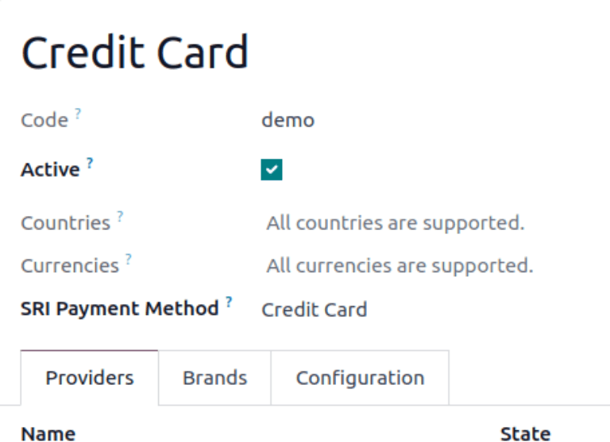

eCommerce workflow
~~~~~~~~~~~~~~~~~~

Identification type and number
******************************

The client who is making a purchase will have the option to indicate their identification type and
number during the checkout process. This information is required to correctly generate the
electronic invoice after the checkout is completed.

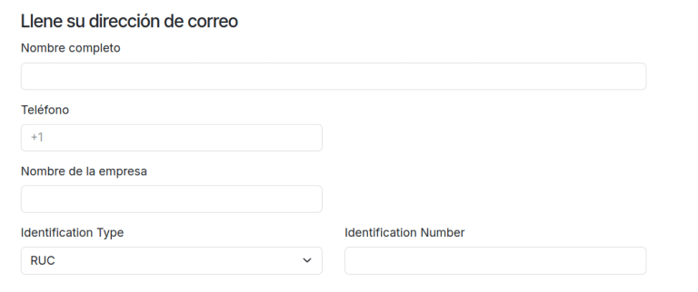

.. note::
   Verification is done to ensure the :guilabel:`Identification Number` field is completed and has
   the correct number of digits. For RUC identification, 13 digits are required. For Cédula,
   9 digits are required.

After finishing the checkout process, a confirmed invoice is generated, ready to be sent manually or
asynchronously to the SRI.

Point of sale electronic invoicing
----------------------------------

Make sure the *Ecuadorian module for Point of Sale* (`l10n_ec_edi_pos`) is :ref:`installed
<l10n_ec/module-installation>` to enable the following features and configurations:

- Choose the SRI payment method in each payment method configuration.
- Manually input the customer's identification type and identification number when creating a
  new contact on *POS*.
- Automatically generate a valid electronic invoice for Ecuador at the end of the checkout process.

Payment method configuration
~~~~~~~~~~~~~~~~~~~~~~~~~~~~

To :doc:`create a payment method for a point of sale <../../sales/point_of_sale/payment_methods>`,
go to :menuselection:`Point of Sale --> Configuration --> Payment Methods`. Then, set the
:guilabel:`SRI Payment Method` in the payment method form.

Invoicing flows
~~~~~~~~~~~~~~~

Identification type and number
******************************

The POS cashier can :ref:`create a new contact for a customer <pos/customers>` who requests an
invoice from an open POS session.

The *Ecuadorian Module for Point of Sale* adds two new fields to the contact creation form:
:guilabel:`Identification Type` and :guilabel:`Tax ID`.

.. note::
   As the identification number length differs depending on the identification type, Odoo
   automatically checks the :guilabel:`Tax ID` field upon saving the contact form. To manually
   ensure the length is correct, know that the :guilabel:`RUC` and :guilabel:`Citizenship` types
   require 13 and 10 digits, respectively.

Electronic invoice: anonymous end consumer
******************************************

When clients do not request an electronic invoice for their purchase, Odoo automatically sets the
customer as :guilabel:`Consumidor Final` and generates an electronic invoice anyway.

.. note::
   If the client requests a credit note due to a return of this type of purchase, the credit note
   should be made using the client's real contact information. Credit notes cannot be created to
   *Consumidor Final* and can be managed :ref:`directly from the POS session <pos/refund>`.

Electronic invoice: specific customer
*************************************

If a customer requests an invoice for their purchase, it is possible to select or create a contact
with their fiscal information. This ensures the invoice is generated with accurate customer details.

.. note::
   If the client requests a credit note due to a return of this type of purchase, the credit note
   and return process can be managed :ref:`directly from the POS session <pos/refund>`.

Financial reports
=================

In Ecuador, there are fiscal reports that the company presents to SRI. Odoo supports two of the main
financial reports used by companies: **reports 103** and **104**.

To get these reports, go to
:menuselection:`Accounting app --> Reporting --> Statements Reports --> Tax Report` and then filter by
`Tax Report 103` or `Tax Report 104`.

Report 103
----------

This report contains information on income tax withholdings in a given period, and it can be
reported monthly or semi-annually. The report contains information about base, tax amounts, and tax
codes, and it can be use for SRI reporting.

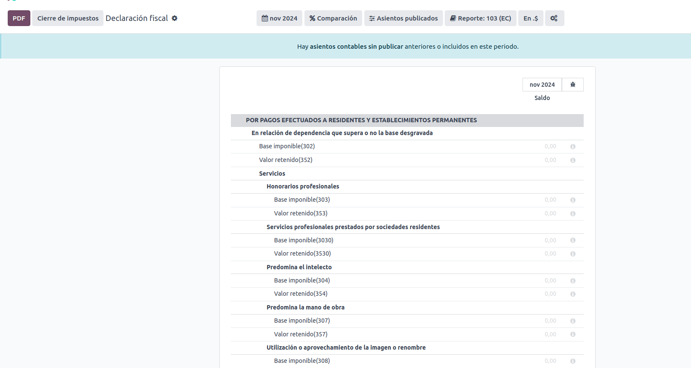

Report 104
----------

This report contains information on VAT tax and VAT withholding for a given period, and it can be
generated monthly or semi-annually. The report contains information about base, tax amounts, and
tax codes, and it can be use for SRI reporting.

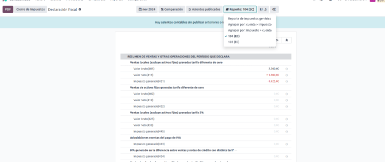

.. _ecuador/ats:

ATS report
----------

:ref:`Install <general/install>` the *ATS Report* (`l10n_ec_reports_ats`) module to enable
downloading the ATS report in XML format.

.. note::
   The Ecuadorian *ATS Report* module depends on the previous installation of the *Accounting* app
   and the *Ecuadorian EDI module*.

Configuration
~~~~~~~~~~~~~

To issue electronic documents, ensure the company is configured as explained in the
:ref:`electronic invoice <l10n_ec/configure-your-company>` section.

In the :abbr:`ATS (Anexo Transaccional Simplificado)`, every document generated in Odoo (invoices,
vendor bills, sales and purchases withholdings, credit notes, and debit notes) will be included.

Vendor bills
************

When generating a vendor bill, it is necessary to register the authorization number from the
invoice that the vendor generated for the purchase. To do so, go to
:menuselection:`Accounting app --> Vendors --> Bills` and select the bill. Then, enter the number
from the vendor's invoice in the :guilabel:`Authorization Number` field.

Credit and debit notes
**********************

When generating a credit note or debit note manually or through an import, it is necessary to link
this note to the sales invoice that is being modified by it.

.. note::
   Remember to add all required information to the documents before downloading the :abbr:`ATS
   (Anexo Transaccional Simplificado)` file. For example, add the *Authorization Number* and the
   *SRI Payment Method* on documents, when needed.

XML generation
~~~~~~~~~~~~~~

To generate the :abbr:`ATS (Anexo Transaccional Simplificado)` report, go to
:menuselection:`Accounting --> Reports --> Tax Report`. Choose a time period for the desired
:abbr:`ATS (Anexo Transaccional Simplificado)` report, then click :guilabel:`ATS`.

The downloaded XML file is ready to be uploaded to *DIMM Formularios*.

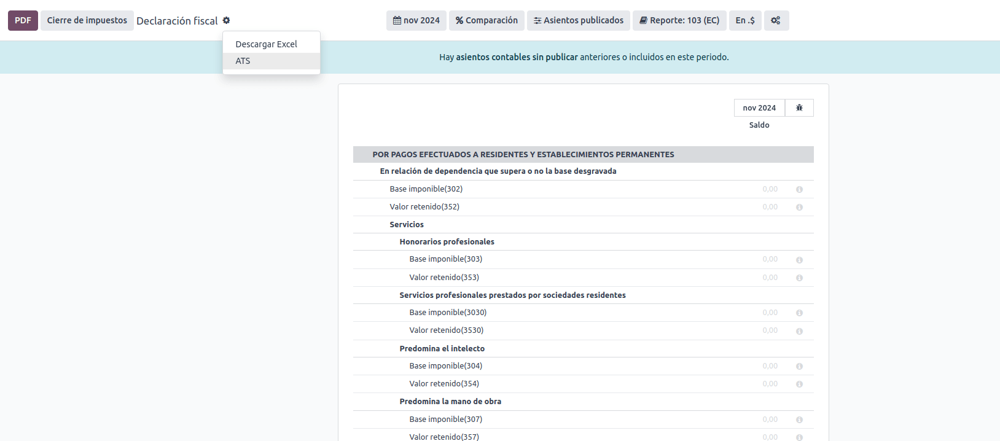

.. note::
   When downloading the :abbr:`ATS (Anexo Transaccional Simplificado)` report, Odoo generates a
   warning pop-up alerting the user if a document(s) has missing or incorrect data. Nevertheless,
   the XML file can still be downloaded.
